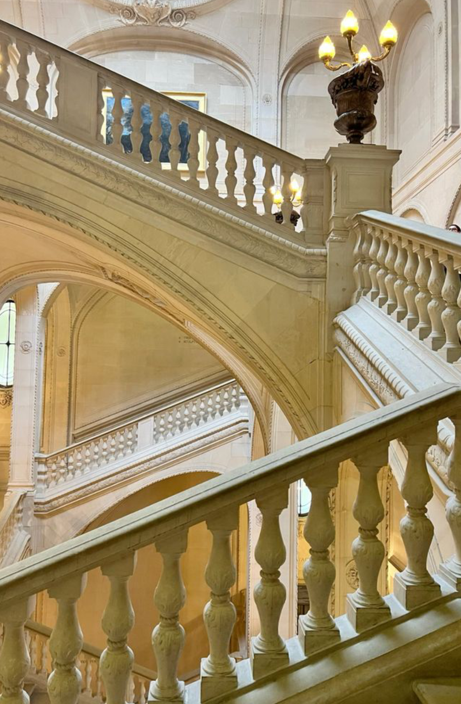

    
    

        <samp>
          about us.
           
          &nbsp;disabled film student in the us. code as a hobby and not for work,  
          &nbsp;but we've& done freelance html/css within the past year or so.
           
           
        </samp>
        <!-- languages -->
        <samp>
          languages
           
          &nbsp;fluent in html/css and intermediate in js/ts.  
          &nbsp;learning python. also fluent in eng/esp.
           
           
        </samp>
        <!-- hyperlinks -->
        <samp>
          <a href="https://louvre.surge.sh">system website.</a>&nbsp; <a href="https://x.com/lesbrinas">public twitter.</a>&nbsp; <a href="https://pronouns.cc/@louvre">prn.cc.</a>
        </samp>
         
         
    

